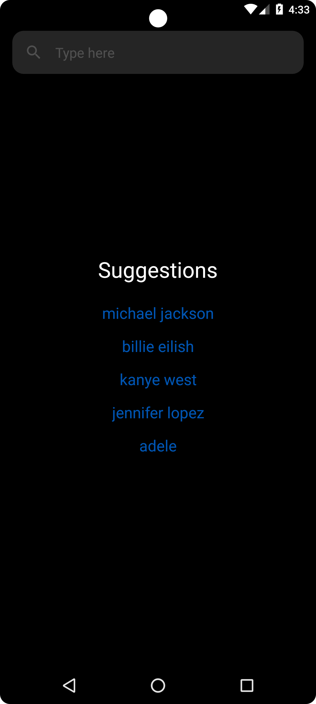
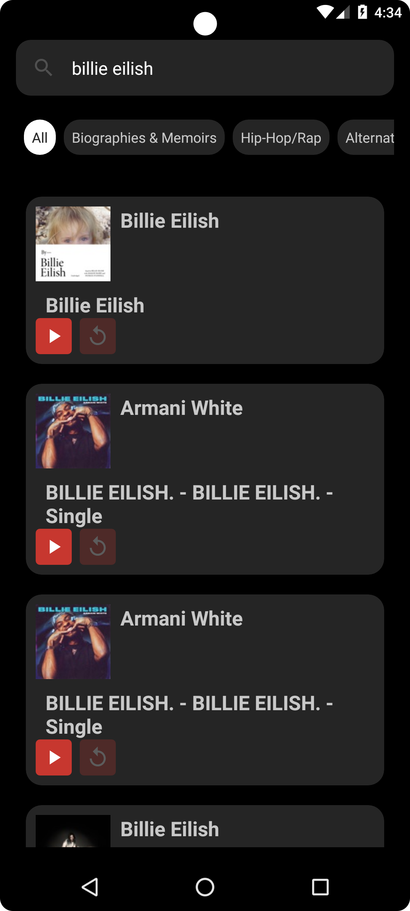
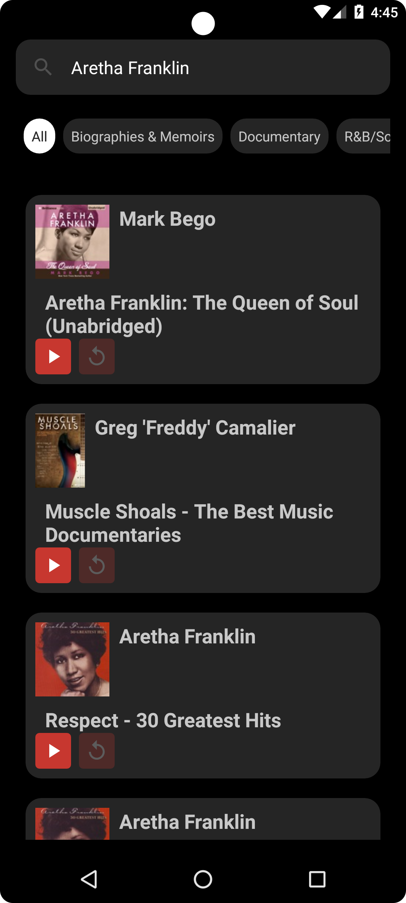

# i-search

iTunes API client app to search and listen to movies, music, podcasts, and more.

## Features

- Search for different types of media such as movies, music, podcasts and more
- View and listen to search results
- Search quickly and easily
- Category option to filter results

## Tech

- [Dependency Injection-Hilt](https://developer.android.com/training/dependency-injection/hilt-android)
- [Retrofit](https://square.github.io/retrofit/)
- [Moshi](https://github.com/square/retrofit/tree/master/retrofit-converters/moshi)
- [LiveData](https://developer.android.com/topic/libraries/architecture/livedata)
- [KotlinFlows](https://developer.android.com/kotlin/flow)
- [ViewModel](https://developer.android.com/topic/libraries/architecture/viewmodel?gclid=Cj0KCQjwmouZBhDSARIsALYcouowU4bI_Dxt9XRlsd4-qAblwn2Vk3jgw86XJFJdhJuraSbTxzGNgwMaAvejEALw_wcB&gclsrc=aw.ds)
- [ViewBinding](https://developer.android.com/topic/libraries/view-binding)
- [Glide](https://github.com/bumptech/glide)
- [Exoplayer](https://github.com/google/ExoPlayer)
- [Coroutine](https://developer.android.com/kotlin/coroutines)
- [Okhttp](https://square.github.io/okhttp/)
- [Navigation](https://developer.android.com/guide/navigation/get-started)

## Screenshots

<kbd></kbd>
<kbd></kbd>
<kbd></kbd>